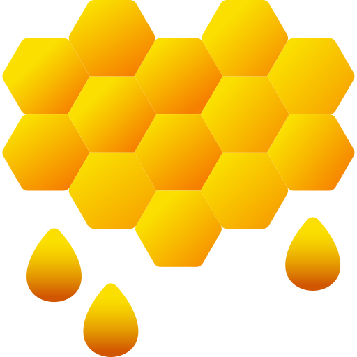

<!-- TITLE -->
 

  
  <h1 align="center">multik8s</h3>
  

     A tool to access pod information across multiple Kubernetes contexts at once.
  

<!-- TABLE OF CONTENTS -->

  
Table of Contents

  <ol>
    <li>
      <a href="#about-the-project">About The Project</a>
    </li>
    <li>
      <a href="#usage">Usage</a>
    </li>
    <li>
      <a href="#limitations">Limitations</a>
    </li>
    <li>
      <a href="#setup">Setup</a>
    </li>
  </ol>

---

## About The Project

`multik8s` is a tool to access pod information across multiple Kubernetes contexts at once.

## Usage
- Follow logs from pods in a given namespace :
    - `multik8s get logs [-n namespace] [-p pod] [--follow] [--tail nbr]`
- List pods in a given namespace :
    -  `multik8s get pods [-n namespace] [-p pod]`

## Limitations
Currently, the namespace should be the same on all targeted clusters.

## Setup
Tested on ARM64 using Go 1.18.3.

`make build`
